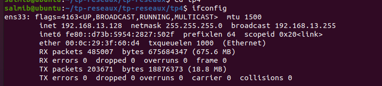
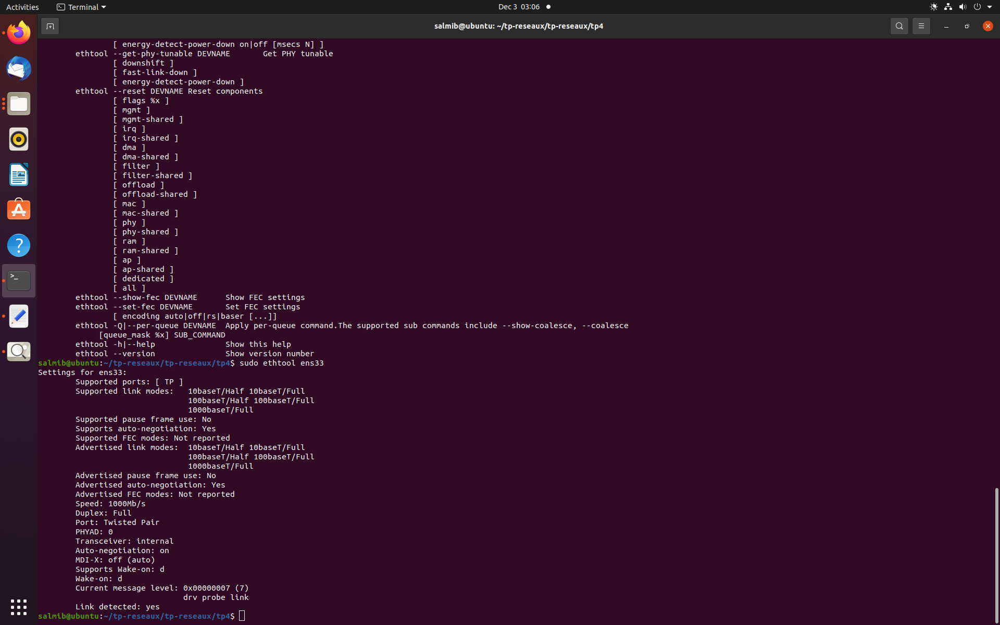
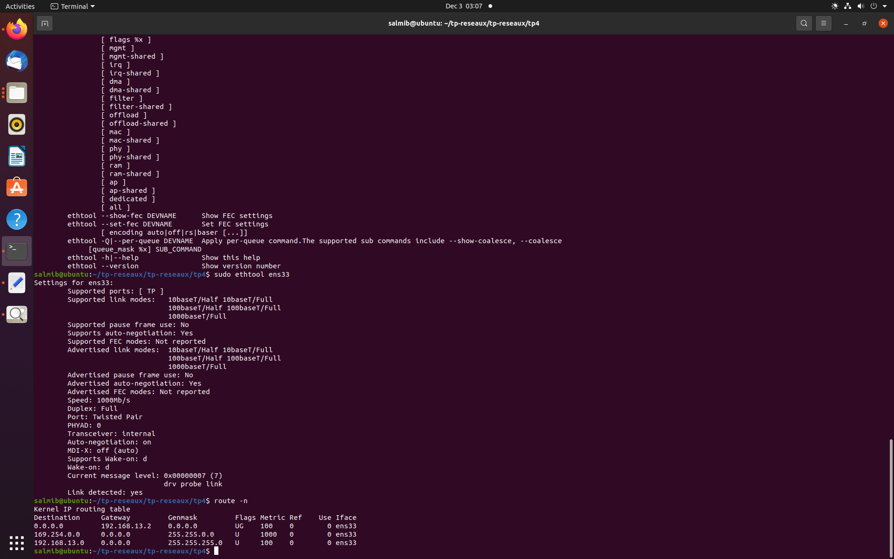
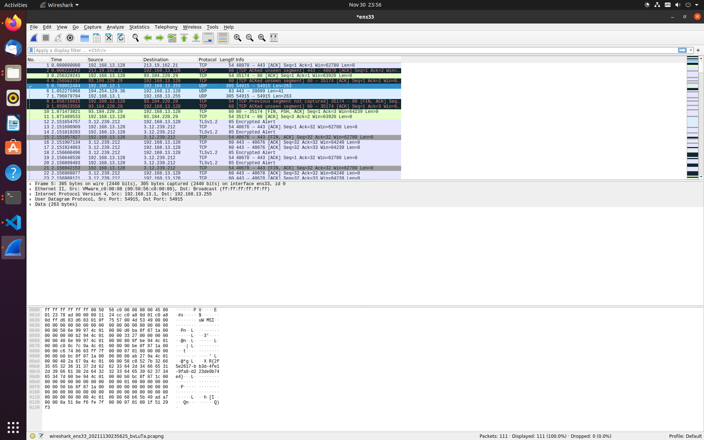
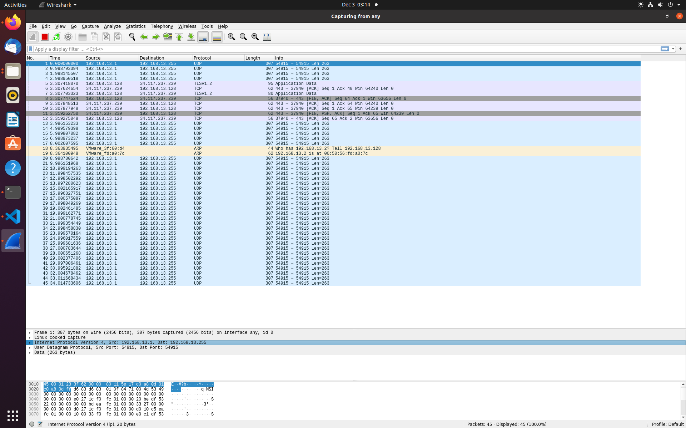
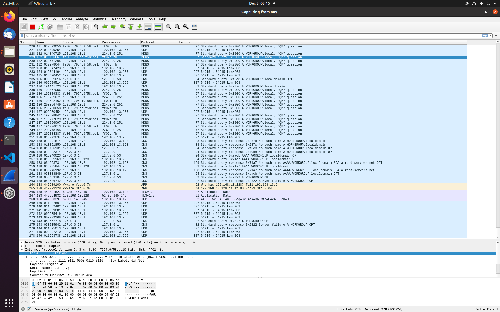
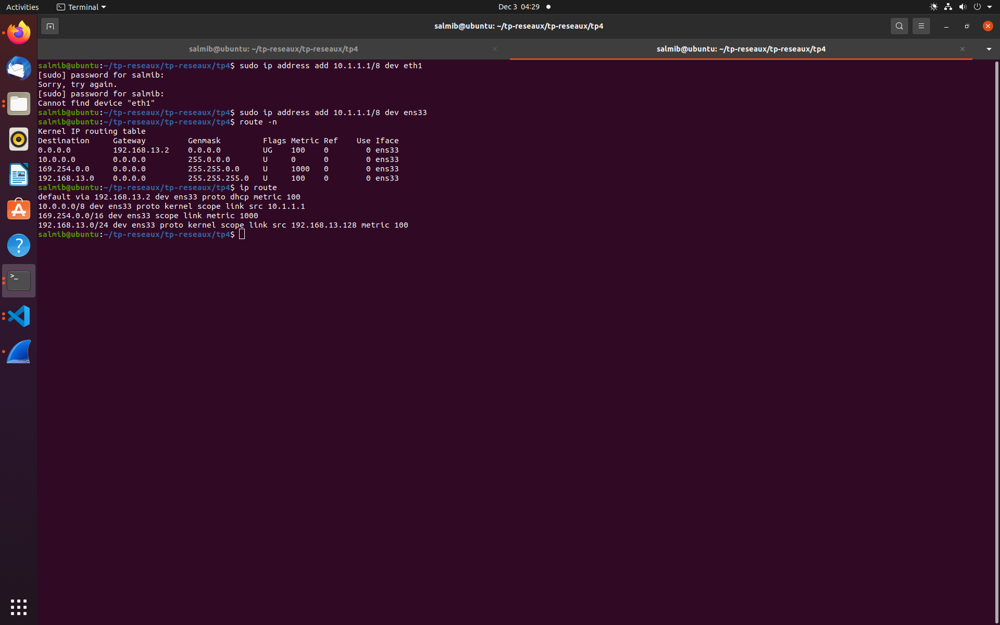
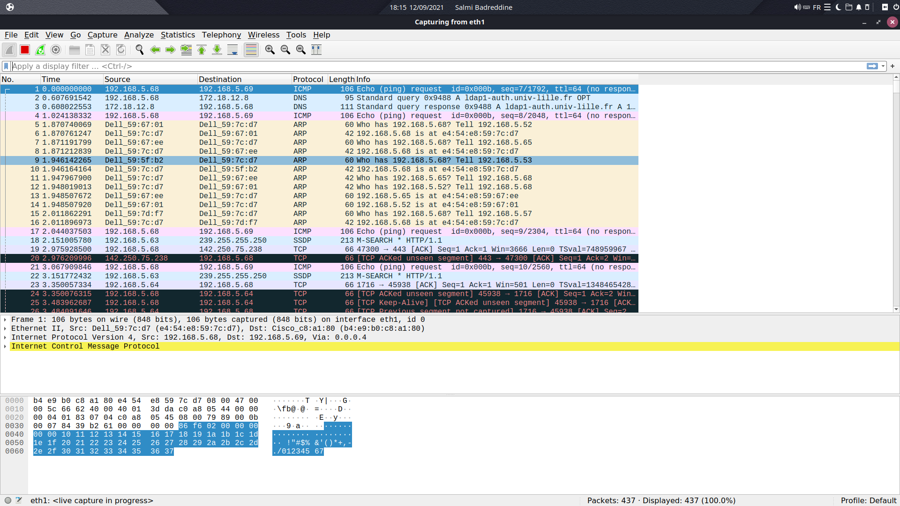

# Rapport pour le TP4 : Liaison de données

## Binome

* SALMI Badr-eddine

## Adressage

1. Sur votre machine, quel est le nom de l’interface connectée au réseau de la salle de TP ? Quelle est son
adresse IPv4 ? Quelle est son adresse IPv6 ? Quelle est son adresse MAC ?

- Le nom de l'interface est : ens33
    * Son Ipv4 est 192.168.13.128
    * Son Ipv6 est fe80::d73b:5954:2827:502f
    * 00:0c:29:3f:60:d4 
    

2. Donnez les principales caractéristiques de cette interface : quelle est sa vitesse actuelle ? Est-ce la vitesse
maximale supportée par l’interface ? Quel le mode de duplex ? Vérifiez que l’interface est bien
connectée.

-   ```
    sudo apt-install ethtool
    sudo ethtool ens33 
    ```
 	* Speed: 1000Mb/s
    * La vitesse maximale supporté par l'interface ici est 1000Mb/s
    * Le mode duplex est FULL
    * L'interface est bien connecté : Link detected: yes


3. Quelle est la classe de l’adresse IPv4 ? Quel est son masque ? Quelle est l’adresse du réseau au format
CIDR ? Quelle est l’adresse de broadcast ? Combien d’hôtes peut-on adresser sur ce réseau ? Cette
adresse est-elle routable au sein d’un réseau local ? Est-elle routable sur internet ?


* Classe C de 192.0.0.0 -> 223.255.255.255

- Sa classe est donc une classe de type C
    * Son masque est 255.255.255.0 soit un masque de 24.
    * Adresse réseau CIDR : 192.168.13.128
    * L'adresse broadcast est 192.168.13.255
    * Le nombre d'hôte qu'on peut on adresser sur ce réseau est 254
    * Elle est routable sur un réseau local car le routeur est configuré sur le bon réseau.
    * Elle n'est pas routable sur internet car elle appartient à la plage d'adresse ip privées. 

4. Écrivez les 16 octets de l’adresse IPv6 sans abréviation. Écrivez en dessous les 16 octets du masque.
Combien d’hôtes peut-on adresser sur ce réseau ? Cette adresse est-elle routable au sein d’un réseau
local ? Est-elle routable sur internet ? Quelle est l’étendue (scope) de cette adresse ?

- 16 octets d'adresse : fe80:0000:0000:0000:d73b:5954:2827:502f
- 16 octets du masque : ffff:ffff:ffff:ffff:0000:0000:0000:0000
- Nombre d'hôte 2<sup>64</sup> -1
- L'adresse est routable sur un réseau local.
- Elle n'est pas routable sur internet car elle appartient à la plage d'adresse ip privées. 

   Affichez la table de routage. Quelle est l’adresse de la passerelle IP ?

- L'adresse de la passerelle IP est : 192.168.5.1


5. Avec Wireshark, lancez une capture de trames sur l’interface connectée au réseau de la salle de TP.
Testez la connectivité IPv4 et IPv6 avec votre voisin.

- Pour traiter les paquets envoyé par ipv6 j'ai decoché l'ipv4 .

  
6. Arrêtez la capture . La transmission qui nous intéresse est noyée parmi d’autres trames qui nous
parasitent.
Pour simplifier la lecture, filtrez la capture de manière à ce que soient affichées uniquement les trames
émises par votre machine ou à destination de votre machine. Attention : les trames ethernet ne
contiennent pas toujours un paquet IP.
Pour savoir comment utiliser les filtres d’affichage, référez-vous à l’aide de Wireshark :
[https://www.wireshark.org/docs/wsug_html_chunked/ChWorkDisplayFilterSection.html](https://www.wireshark.org/docs/wsug_html_chunked/ChWorkDisplayFilterSection.html)
## IPV4
  
## IPV6 
 
7. Quel est le protocole utilisé pour tester la connectivité IP ? Ce protocole est le couteau suisse d’IP. Il ne
sert pas seulement à tester la connectivité IP. Quel est le type et le code des messages de requête et de
réponse ?

* le protocole utilise pour tester la connectivité IP est TCP , 

8. La plupart des protocoles réseau permettent, dans l’entête, de spécifier quel est le type du contenu
véhiculé.
Donnez le code du contenu de la trame ethernet.
Donnez le code du contenu du paquet IP.

   Les paquets IP transmis à votre voisin sont encapsulés dans des trames ethernet. Pour que ces trames parviennent à destination, il faut connaître l’adresse ethernet de votre voisin. Cette adresse est aussi appelée adresse matérielle ou adresse MAC (Media Access Control), ou encore adresse de couche liaison..

9. Avant l’envoi du ping IPv4, un échange de messages ARP (Address Resolution Protocol) a eu lieu. Quelle
est l’adresse matérielle de destination de la requête ? Que signifie cette adresse ? Quelle est la question
posée par la requête ?

    **Remplacez cette phrase avec votre réponse.**

10. Avant l’envoi du ping IPv6, un échange de messages ICMPv6 de type Neighbor Solicitation et Neighbor
Advertisement a eu lieu. Quelle est l’adresse matérielle de destination de la requête ? Que signifie cette
adresse ? Quelle est l’adresse IP de destination de la requête ? A quoi correspond cette adresse ?

    **Remplacez cette phrase avec votre réponse.**

11. Affichez la liste des correspondances entre adresses IP et adresses ethernet. Vérifiez que l’adresse IPv4 et
l’adresse IPv6 de votre voisin y figurent, associées à son adresse MAC. Attention : les entrées de ce cache
ont une durée de vie limitée à quelques minutes.

    **Remplacez cette phrase avec votre réponse.**

12. A quelles couches du modèle OSI appartiennent les protocoles ethernet, IP, ICMP ?


- Protocoles ethernet => Appartient à la **couche liaison de données** et **la couche physique**

- Protocoles IP => Appartient à la **couche réseau**

- Protocoles ICMP => Appartient à la **couche réseau**

13. Selon vous, de manière générale, pourquoi utilise-t-on l'adresse IP et non uniquement l'adresse MAC pour
les communications réseaux ?

    - Adresse MAC fortement liés au materiel (graver), elle ne donne pas précission sur le réseau, contrairement au adresse IP.
    
     - Les adresses MAC sont attribuées par le fabricant de l'appareil elles sont donc inconnues par le routeur , or ce dernier est le responsable du passage du réseau local à un réseau extérieur c'est pourquoi on utilise les adresses IP comme "direction" indiquée au routeur qui réexpédie les paquets vers les switchs qui eux connaissent les adresses MAC et vont savoir quelle machine est destinataire du paquet

## Point-à-point

Chaque machine de la salle dispose d’au moins 2 interfaces ethernet. Laissez votre machine connectée à la prise EXT, qui vous permet d’atteindre internet ou votre homedir. Utilisez une autre interface ethernet pour la connecter à la machine de votre voisin, en point-à-point, via la
baie de brassage.

1. Vous utilisez un câble droit ou un câble croisé ?

    * On doit utilisez un cable croisé pour assurer la transmission et reception des deux machines

2. Quelle commande utilisez-vous pour vérifier que votre interface est bien connectée, et connaître la vitesse
et le mode de duplex qui ont été négociés entre vos deux machines ?

    * sudo ethtool ens33

3. Affectez une adresse IPv4 privée de classe A à l’interface ethernet. Notez qu’une adresse IPv6 est déjà
associée à cette interface. Elle a été configurée automatiquement.

    Vous remarquerez qu’une même interface réseau peut très bien être associée à plusieurs adresses IP.

     * sudo ip address add 10.1.1.1/8 dev ens33

4. Affichez la table de routage. Que constatez-vous ?

      * On obtient l'adresse Rèseaux suivante : 10.1.1.1/8 qui s'ajoute a notre table de routage



5. Testez la connectivité avec votre voisin.
    * 


## Concentrateur (hub)

Brassez votre poste de travail sur le concentrateur (hub) situé dans la baie de brassage.
Assurez-vous que deux de vos voisins y sont connectés également.
Supprimez les filtres de capture et d'affichage préalablement configurés.

1. Lancez une capture de trames sur un poste, et transmettez un ping entre les deux autres postes. Que
constatez-vous ? Déduisez-en la manière dont les données sont transmises par cet équipement. Les
données émises par un poste sont-elles reçues par ce même poste ?

    * Nous interceptons les pings des deux autres postes.

2. Recommencez la manipulation en désactivant le mode promiscuous de wireshark. A quoi sert-il ?

    * Il sert a filtrer les trames qui ne sont pas adresseés a moi

3. Quel est le mode de duplex des interfaces connectées au hub ? Quelle en est la signification ?

    * Half-duplex , signifierle canal de communication la communication est faite dans un mono-sence

4. Quelles sont les topologies physique et logique du réseau constitué par le concentrateur et les postes qui y
sont connectés ?

    * en bus logique et en etoile physique

5. Lancez la commande « iperf -s » sur un poste et « iperf -c ip_du_serveur » sur un autre poste pour lancer
un test de bande passante. Notez le débit atteint et les valeurs du compteur de collisions (voir annexe)
avant et après la manipulation.
Connectez un poste supplémentaire sur le hub (soit au minimum 4 postes) et réalisez de nouveau la manip
en parallèle sur les deux paires de postes.
Notez le débit atteint et les nouvelles valeurs des compteurs de collisions. Déduisez-en la manière dont
fonctionne un hub.

    * On remarque que le nombre des collission repartie a l'environ de 4 et la bande se reduit 

   Les postes connectés entre eux via des concentrateurs forment un **domaine de collision**.


## Commutateur (switch)

Brassez votre poste de travail sur le commutateur (switch) situé dans la baie de brassage.
Assurez-vous que deux de vos voisins y sont connectés également.
Supprimez les filtres de capture et d'affichage préalablement configurés.
Réactivez le mode promiscuous.

1. Lancez une capture de trames sur un poste, et transmettez un ping entre les deux autres postes. Que
constatez-vous ? Déduisez-en la manière dont les données sont transmises par cet équipement.

	* On remarque que le poste avec lequel on a lancé la capture de trames ne recevait pas les trames des autres postes qui se ping entre eux.l'équipement transmet les données d'une maniére 		unique de l'adresse source à l'adresse dest sans partager la donnée sur tout le réseau

2. Quel est le mode de duplex des interfaces connectées au hub ? Quelle en est la signification ?

    * C'est du FULL DUPLEX , ça signifie que la communication se fait dans les deux sens.

3. Quelles sont les topologies physique et logique du réseau constitué par le concentrateur et les postes qui y
sont connectés ?

    *la topologie physique et logique toutes les deux sont en Étoile.

4. Lancez la commande « iperf -s » sur un poste et « iperf -c ip_du_serveur » sur un autre poste pour lancer
un test de bande passante. Notez le débit atteint et les valeurs du compteur de collisions (voir annexe)
avant et après la manipulation.
Connectez un poste supplémentaire sur le switch (soit au minimum 4 postes) et réalisez de nouveau la
manip en parallèle sur les deux paires de postes.
Notez le débit atteint et les nouvelles valeurs des compteurs de collisions. Déduisez-en la manière dont
fonctionne un switch.

    ```iperf -c 192.168.10.6

Client connecting to 192.168.10.6, TCP port 5001
TCP window size:  144 KByte (default)

[  3] local 192.168.10.5 port 49548 connected with 192.168.10.6 port 5001
[ ID] Interval       Transfer     Bandwidth
[  3]  0.0-10.2 sec  6.00 MBytes  4.91 Mbits/sec
  ```

    Pour paramétrer les équipements réseau et obtenir des informations sur leur configuration, il faut établir une
liaison série entre votre poste de travail et le port console de l'équipement en question.
Cette liaison permet d'établir une connexion dite « hors bande », c'est-à-dire en dehors de la bande passante
du réseau ethernet.
Connectez-vous sur le port console d'un switch, noté Sx-C (avec x=R,J,B ou V selon votre baie de brassage).
Utilisez pour cela un câble série DB9-RJ45 (câble bleu et plat) et lancez le programme « minicom ».

    Une fois connecté, tapez sur la touche « entrée » pour afficher le prompt. Si la question « voulez-vous lancer
le setup du switch ? » vous est posée, répondez « non ».
Vous êtes actuellement en mode USER EXEC (prompt >), qui ne permet de lancer qu'un nombre réduit de
commandes, que vous pouvez lister en tapant « ? ». Passez en mode privilégié (prompt #), puis affichez la
table de commutation.

5. Comparez les adresses MAC listées avec celles de vos postes et les ports du switch sur lesquels ils sont
connectés. Comment le switch a-t-il obtenu ces adresses ? Quel est le rôle de la table de commutation
(appelée aussi table d'adresses MAC) ?

    * Il les obtients grâce a certain protocole comme ARP. 

6. Pour fonctionner correctement, le switch a-t-il besoin de connaître les adresses mac des trames ? les
adresses IP des paquets ? Déduisez-en à quels niveaux du modèle OSI interviennent un switch et un hub
et quelles sont les unités de données sur lesquelles ils agissent.

    * Le switch fonctionne au niveau de la couche de liaison des données (couche 2) et parfois dans la couche réseau (couche 3).
    Il prend donc en charge tout protocole du paquet.

7. Concluez sur les avantages du switch par rapport au hub.

    *  Le switch n'a pas forcément besoin d'adresse IP une fois qu'une communication à lieu le switch le retient. Ainsi on le retrouve dans la commande ip neigh. 

8. Selon vous, en fonctionnement normal, une interface d’un commutateur peut-elle être associée au même
moment à plusieurs addresses ethernet ? Une même adresse ethernet peut-elle être associée au même
moment à plusieurs interfaces d’un commutateur ?

    * le poste qui envoie à l'adresse 192.168.5.255 reçoit une réponse de tous postes du réseau.
    il s'agit d'un transfert en broadcast l'adresse ethernet de destination des trames recus est celle du poste qui a diffusé l'envoie des paquets en broadcast.

9. Lancez maintenant une capture de trames sur plusieurs postes connectés au switch et transmettez un ping
vers l'adresse IP 255.255.255.255. Que constatez-vous ? Comment s'appelle ce type de transfert ? Quelle
est l'adresse ethernet de destination des trames reçues ?

    * On constate que tous les postes reçoivent des paquets en broadcast.

10. Envoyez un ping vers l’adresse ff02::1. Que constatez-vous ? Comment s'appelle ce type de transfert ?
Quelle est l'adresse ethernet de destination des trames reçues ?

    * il s'agit de faire communiquer toutes les machines liées à la passerelle eth0 seulement, contrairement au broadcast qui envoie à toutes les machines.

    Un commutateur permet de segmenter les domaines de collisions.
Les postes connectés par l'intermédiaire de commutateurs constituent un **domaine de broadcast**.


## Routeur

Choisissez 2 sous-réseaux IPv4 de classe B. Veillez à ce qu’ils soient différents de votre voisin.
Complétez le schéma suivant en affectant une adresse IP aux interfaces, l’objectif étant que les postes
puissent communiquer ensemble.


Connectez 3 postes, 1 switch et 1 routeur en suivant ce schéma.

1. Configurez les adresses IP sur les interfaces en vous référant à l’annexe.

    * les adresses ipv4 choisis pour se connecté au switch : 
        * 130.20.20.2/17
        * 130.20.20.3/17

2. Ajoutez une route sur les postes de manière à ce que les postes 1 et 2 puissent communiquer avec le 3.

    *     sudo ip address add 130.20.20.2/17 sur le poste 1
    sudo ip address add 130.20.20.3/17 sur le poste 2
    sudo ip address add 130.20.160.2/17  sur le poste 3

3. Après avoir lancé une capture de trames sur les postes 2 et 3, lancez un ping depuis le poste 1 vers le
poste 2, puis vers le poste 3 (voir schéma). Il s'agit d'un transfert unicast. Comparez les valeurs du champ
TTL de l'entête IP des paquets reçus sur les postes 2 et 3. Pourquoi sont-elles différentes ? Quelle est
l'utilité de ce champ ?

    **Remplacez cette phrase avec votre réponse.**

4. Quelle devrait être la valeur du TTL pour que le poste 1 puisse communiquer avec le poste 2, mais pas
avec le poste 3 ? Vérifiez votre réponse en envoyant, depuis le poste 1, un ping avec ce TTL vers les
postes 2 et 3 (voir « man ping »).
Lancez une capture sur le poste 1 et envoyez un ping du poste 1 vers le poste 3 en conservant le TTL que
vous avez choisi. Que se passe-t-il ?

    **Remplacez cette phrase avec votre réponse.**

5. Lancez de nouveau un ping depuis le poste 1 vers le poste 3. Quelles sont l'adresse MAC source de la
trame reçue (sur le poste 3) et l'adresse MAC de destination de la trame envoyée (à partir du poste 1) ?
Selon vous, à quelles interfaces ethernet correspondent ces adresses ? Pour vous aider, lancez la
commande « show interface fastethernet » sur le routeur.

    **Remplacez cette phrase avec votre réponse.**

6. Comment le poste 1 a-t-il su que la trame ethernet contenant le paquet IP à destination du poste 3 devait
être envoyée au routeur ?

    **Remplacez cette phrase avec votre réponse.**

7. Dessinez un schéma des couches OSI utilisées dans chaque équipement mis en jeu dans le transfert
unicast (2 postes, 1 switch et 1 routeur), et tracez une ligne représentant le flux de données passant d'un
équipement à l'autre (communication horizontale) en traversant les couches (communication verticale).

    **Remplacez cette phrase avec votre réponse.**

8. Lancez une capture de trames sur les 3 postes et lancez un ping depuis le poste 1 vers l'adresse
255.255.255.255. Il s'agit d'un transfert en diffusion limitée (broadcast). Que constatez-vous ?

    **Remplacez cette phrase avec votre réponse.**

9. Lancez une capture de trames sur les 3 postes et lancez un ping depuis le poste 3 vers l'adresse de
broadcast du réseau sur lequel se trouvent les postes 1 et 2. Que constatez-vous ?

    **Remplacez cette phrase avec votre réponse.**

    Exécutez les commandes suivantes sur le routeur : <br>
    _Router(config)#interface fastEthernet 0/0_ <br>
    _Router(config-if)#ip directed-broadcast_

10. Recommencez la manipulation précédente. Il s'agit d'un transfert en diffusion dirigée. Que constatez-
vous ? Quelle est l'adresse IP de destination des paquets reçus ? Selon vous, pourquoi ce mode de
transfert est-il désactivé par défaut ?

    **Remplacez cette phrase avec votre réponse.**

11. Quelle est la différence entre diffusion limitée, diffusion dirigée et unicast.

    **Remplacez cette phrase avec votre réponse.**

12. Comment un routeur réagit à ces différents types de paquets ? Concluez sur la différence entre un routeur
et un switch vis-à-vis de la diffusion IP.

    **Remplacez cette phrase avec votre réponse.**

13. Reliez votre routeur à celui de votre voisin de manière à ce que touts les machines puissent communiquer
ensemble.

    **Remplacez cette phrase avec votre réponse.**
